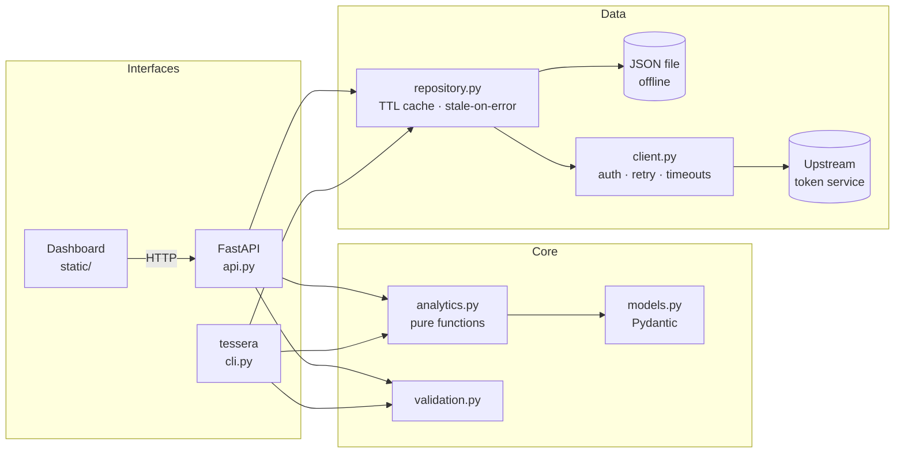

<p align="center">
  
</p>

# Tessera

**A patient census you can read at a glance.** Tessera turns hospital patient records into a
dashboard, a documented REST API and a CLI, all built on one tested analytics core.

[](https://github.com/Sandeepsrinivasan-14/pcp-5-CA-1-REPO/actions/workflows/ci.yml)
[](https://github.com/Sandeepsrinivasan-14/pcp-5-CA-1-REPO/actions/workflows/secret-scan.yml)


> **Why "Tessera"?** A *tessera* is a single tile in a mosaic. In Tessera every patient is one tile,
> and the picture they make together is the ward: who is admitted, who has gone home, which
> department is busiest, and which record stands out. The four-tile logo uses the same language:
> filled for admitted, hollow for discharged.

It began as coursework scripts for a Patient API assignment and has been rebuilt as an installable,
typed, tested package with a layered design, CI and a Docker image. Every rule from the original
brief is still there, now as a reusable function.

> **Data note:** the repo ships a *fully synthetic* dataset (`data/sample_patients.json`) so you
> can run everything offline. No real patient data and no credentials are included anywhere.

---

## ✨ Features

| Area | What you get |
| --- | --- |
| **Dashboard** | A patient census (one cell per patient), department ledger, searchable and sortable directory, patient detail drawer, light and dark themes, keyboard and screen-reader friendly |
| **REST API** | 9 documented endpoints, Swagger UI at `/docs`, consistent `{"message": ...}` errors, request IDs and timing headers |
| **Analytics** | Highest bill, longest stay, admission summary, per-department rollups (volume, stay length, revenue) |
| **Resilient client** | Token auth, request timeouts, automatic retry with backoff for gateway errors (built for sleepy free-tier hosts) |
| **Smart caching** | TTL cache that serves *stale* data if a refresh fails, instead of turning an outage into a 502 |
| **CLI** | `tessera` with JSON or table output, a `doctor` configuration check, and proper exit codes |
| **Safe by default** | No credentials in source; `.env` auto-loading; secret scanning in CI and pre-commit; strict CSP on the dashboard |
| **Quality gates** | `ruff`, `mypy --strict`, `pytest` (99% coverage), GitHub Actions on Python 3.10–3.13 |
| **Deployable** | Multi-stage, non-root Dockerfile with a health check, plus `docker-compose.yml` |

---

## 🖥 Product tour

Start the server and open **`http://localhost:8000/`**. There is nothing to build: the dashboard is
plain HTML, CSS and JavaScript served by the API itself, with no third-party requests.

### The census


The headline answers the first question a ward lead asks: *how many patients are admitted right now?*
Below it, every patient is one tile, grouped by department. **Filled** means admitted, **hollow**
means discharged, a **rose ring** marks the highest bill and a **rose dot** marks the longest stay.
Under the census, the department ledger compares volume, admissions, average stay and billing, and
the directory lists every record.

### Filter by department


Select a department in the ledger and the directory narrows to it. Search by name, filter by
status, sort any column (sorting runs on the server before paging, so it holds across pages).

### Open a patient


Click a tile or a row to open the record in a drawer: billing breakdown, time admitted, doctor and status.
Focus moves into the drawer, `Esc` closes it, and focus returns to the tile you came from.

### When nothing matches


Empty results explain themselves and offer a way back instead of showing a blank table.

### Dark theme and phones

| Dark theme | Phone width |
| --- | --- |
|  |  |

The theme follows your system setting, can be switched in the header, and is remembered. The layout
works down to phone width with no horizontal scrolling.

- **Accessible:** keyboard support, visible focus, labelled controls, `prefers-reduced-motion` respected.
- **Secure:** strict Content-Security-Policy (`script-src 'self'`), API text inserted with
  `textContent` only, never `innerHTML`. Tests enforce both.

---

## 🏗 Architecture



**Why this shape?** The analytics layer is *pure*: lists in, results out, no network and no
mutation. That is why the business rules are easy to test exhaustively, and why the dashboard, API
and CLI can share them without duplicating logic. The data source sits behind a small
`PatientRepository` protocol, so swapping in a database later touches one module.

---

## 🚀 Quickstart

### 1. Offline demo (no credentials needed)

```bash
git clone https://github.com/Sandeepsrinivasan-14/pcp-5-CA-1-REPO.git
cd pcp-5-CA-1-REPO
python -m venv .venv && source .venv/bin/activate
pip install -e ".[dev]"

export PATIENT_API_DATA_FILE=data/sample_patients.json
tessera serve            # dashboard at http://127.0.0.1:8000/  ·  API docs at /docs
```

### 2. Against the real upstream service

```bash
cp .env.example .env        # open it and fill in your credentials
tessera doctor           # confirms the setup; secrets are never printed
tessera serve
```

`.env` is loaded automatically, is **git-ignored**, and real environment variables take priority over
it. Credentials never live in source control.

### 3. Docker

```bash
docker compose up --build   # offline demo on http://localhost:8000
```

---

## 📡 API

Interactive docs live at **`/docs`** (Swagger) and **`/redoc`**.

| Method | Path | Description | Errors |
| --- | --- | --- | --- |
| GET | `/` | The dashboard | |
| GET | `/health` | Liveness probe | |
| GET | `/meta` | Version and data source (never any credentials) | |
| GET | `/patients` | List with `department`, `status`, `q` (name), `sort`, `order`, `limit`, `offset` | 422 bad paging or sort field |
| GET | `/patients/{id}` | One patient | 400 invalid id · 404 not found |
| GET | `/patients/filter?department=` | Patients in a department (case-insensitive) | 400 missing param |
| GET | `/patients/highest-bill` | Highest total bill (consultation + medicine + lab) | 404 no data |
| GET | `/patients/longest-stay` | Longest admission | 404 no data |
| GET | `/patients/admission/summary` | Admitted / discharged counts, mean age | 404 no data |
| GET | `/analytics/departments` | Per-department rollup | |

`sort` accepts `id`, `name`, `department`, `age`, `daysAdmitted` or `totalBill`; `order` is `asc` or `desc`.
Upstream failures return **502**; missing credentials return **503**, and `/health` keeps working in
both cases.

<details>
<summary><b>Example responses</b> (from the bundled synthetic dataset)</summary>

```http
GET /patients/admission/summary
{ "admittedCount": 16, "dischargedCount": 24, "averageAge": 45.98 }

GET /patients/highest-bill
{ "id": 220, "name": "Vikram Das", "department": "Oncology", "totalBill": 7725.0 }

GET /patients/abc
400  { "message": "Invalid ID format. ID must be a number." }

GET /patients/9999
404  { "message": "patient 9999 not found" }
```

</details>

---

## 💻 CLI

```bash
tessera doctor
tessera summary
tessera get 201
tessera filter cardiology --format table
tessera departments --format table
tessera highest-bill
tessera longest-stay
tessera serve --port 8000 --reload
```

Exit codes: `0` success · `1` not found / bad input · `2` configuration error.

---

## ⚙️ Configuration

Set these in `.env` (copy `.env.example`) or as environment variables.

| Variable | Default | Purpose |
| --- | --- | --- |
| `PATIENT_API_STUDENT_ID` | none | Upstream account id (remote mode) |
| `PATIENT_API_PASSWORD` | none | Upstream password (remote mode) |
| `PATIENT_API_SET` | `setA` | Dataset set to request |
| `PATIENT_API_BASE_URL` | `https://t4e-testserver.onrender.com/api` | Upstream base URL |
| `PATIENT_API_TIMEOUT` | `45` | Seconds per upstream request |
| `PATIENT_API_RETRIES` | `3` | Retries on 429/502/503/504 |
| `PATIENT_API_CACHE_TTL` | `60` | Seconds a fetched dataset is reused |
| `PATIENT_API_DATA_FILE` | none | If set, read from this file and skip the network |

---

## 🔐 Handling credentials

- Secrets are read only from the environment or a local, git-ignored `.env`. There are none in the repository.
- `tessera doctor` reports each secret as *set* or *missing* and never prints a value. Tests enforce this.
- `/meta` and every other endpoint expose no credential data. Tests enforce this too.
- **Gitleaks** runs in CI and as a pre-commit hook, so a secret is caught before it reaches GitHub.

See [SECURITY.md](SECURITY.md) for what to do if a secret is ever committed.

---

## 🧠 Design decisions

- **Deterministic tie-breaking.** Highest bill → first record wins (stable sort). Longest stay →
  *later* record wins (`reduce` semantics). Both are pinned by tests, not left to chance.
- **Strict ID parsing.** Python's `int()` accepts `"2_01"` and non-ASCII digits. Patient IDs are
  parsed with a stricter rule so malformed input returns a clean 400 instead of matching by accident.
- **One bad record never sinks the dataset.** Malformed rows are logged and skipped.
- **Stale-on-error caching.** A refresh failure serves the last good data rather than erroring.
- **Honest sorting.** Sorting happens on the server before pagination, so "sort by bill" ranks the
  whole dataset, not just the page you happen to be viewing.
- **`reduce` is intentional.** The original brief required `functools.reduce` for the admission
  summary and longest-stay; those two functions keep it.
- **camelCase JSON contract preserved** (`daysAdmitted`, `totalBill`) while the Python side uses
  idiomatic snake_case, via Pydantic aliases.
- **Backward compatible.** The original singular routes (`/patient/longest-stay`,
  `/patient/admission/summary`) still work as hidden aliases.
- **No build step for the UI.** Plain files keep the project dependency-free on the front end and
  make a strict CSP straightforward.

---

## 🗂 Project layout

```
.
├── src/tessera/
│   ├── api.py            FastAPI app factory, routes, error mapping, dashboard hosting
│   ├── analytics.py      Pure business logic (including sorting)
│   ├── cli.py            tessera
│   ├── client.py         Auth + dataset download (retries, timeouts)
│   ├── repository.py     File / remote / in-memory sources, TTL cache
│   ├── models.py         Pydantic models
│   ├── config.py         Environment and .env settings
│   ├── validation.py     Input parsing
│   ├── exceptions.py     Error hierarchy
│   └── static/           Dashboard: index.html, styles.css, app.js, theme.js
├── tests/                160+ tests (unit, API, client, CLI, dashboard, credentials)
├── data/                 Synthetic sample dataset
├── scripts/              Reproducible dataset generator
├── docs/                 Architecture, operations, screenshots
├── .github/workflows/    CI (lint, types, tests py3.10–3.13, Docker smoke test) and secret scan
├── Dockerfile · docker-compose.yml · Makefile
└── pyproject.toml
```

---

## 🧪 Development

```bash
make install     # editable install + dev tools
make check       # ruff + mypy --strict + pytest (what CI runs)
make serve       # hot-reloading API and dashboard on the sample data
make help        # all targets
```

See [CONTRIBUTING.md](CONTRIBUTING.md), [docs/architecture.md](docs/architecture.md) and
[docs/operations.md](docs/operations.md).

---

## 🗺 Roadmap

- [ ] Pluggable database repository (SQLite/PostgreSQL) behind the existing protocol
- [ ] API-key auth and rate limiting for the HTTP layer
- [ ] Date-based analytics and trend charts once admission/discharge timestamps are available
- [ ] Prometheus metrics endpoint

---

## 👤 Author

**Sandeep Srinivasan S**: B.Tech Computer Science & Medical Engineering (AI & Data Analytics), SRIHER, Chennai.

Licensed under the [MIT License](LICENSE).
