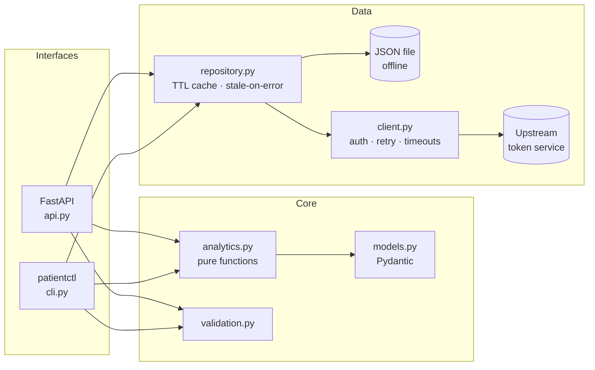

# 🏥 Patient Records API

[](https://github.com/Sandeepsrinivasan-14/pcp-5-CA-1-REPO/actions/workflows/ci.yml)


A token-authenticated **hospital patient data service**: a resilient API client, a pure analytics
engine, a documented REST API (FastAPI), and a CLI, all built around one tested core.

It began as a set of coursework scripts for a Patient API assignment. It has since been
restructured into an installable package with a layered design, strict typing, a 120+ test suite
and CI, so every business rule from the original brief is now a tested function you can reuse from
the API, the CLI, or your own code.

> **Data note:** the repo ships a *fully synthetic* dataset (`data/sample_patients.json`) so you
> can run everything offline. No real patient data is included anywhere.

---

## ✨ Features

| Area | What you get |
| --- | --- |
| **REST API** | 8 documented endpoints, Swagger UI at `/docs`, consistent `{"message": ...}` errors, request IDs and timing headers |
| **Analytics** | Highest bill, longest stay, admission summary, per-department rollups (volume, stay length, revenue) |
| **Resilient client** | Token auth, request timeouts, automatic retry with backoff for gateway errors (built for sleepy free-tier hosts) |
| **Smart caching** | TTL cache that serves *stale* data if a refresh fails, instead of turning an outage into a 502 |
| **CLI** | `patientctl` with JSON or table output and proper exit codes |
| **Offline mode** | Run entirely from a JSON file, with no credentials or network |
| **Quality gates** | `ruff`, `mypy --strict`, `pytest` (99% coverage), GitHub Actions on Python 3.10–3.13 |
| **Deployable** | Multi-stage, non-root Dockerfile with a health check, plus `docker-compose.yml` |

---

## 🏗 Architecture



**Why this shape?** The analytics layer is *pure*: lists in, results out, no network and no
mutation. That is why the business rules are easy to test exhaustively, and why the API and CLI
can share them without duplicating logic. The data source sits behind a small `PatientRepository`
protocol, so swapping in a database later touches one module.

---

## 🚀 Quickstart

### 1. Offline demo (no credentials needed)

```bash
git clone https://github.com/Sandeepsrinivasan-14/pcp-5-CA-1-REPO.git
cd pcp-5-CA-1-REPO
python -m venv .venv && source .venv/bin/activate
pip install -e ".[dev]"

export PATIENT_API_DATA_FILE=data/sample_patients.json
patientctl serve            # → http://127.0.0.1:8000/docs
```

### 2. Against the real upstream service

```bash
cp .env.example .env        # then fill in your credentials; .env is git-ignored
set -a; source .env; set +a
patientctl serve
```

Credentials are read **only from environment variables**; they are never in source control.

### 3. Docker

```bash
docker compose up --build   # offline demo on http://localhost:8000
```

---

## 📡 API

Interactive docs live at **`/docs`** (Swagger) and **`/redoc`**.

| Method | Path | Description | Errors |
| --- | --- | --- | --- |
| GET | `/health` | Liveness probe | |
| GET | `/patients` | List with `department`, `status`, `q` (name), `limit`, `offset` | 422 bad paging |
| GET | `/patients/{id}` | One patient | 400 invalid id · 404 not found |
| GET | `/patients/filter?department=` | Patients in a department (case-insensitive) | 400 missing param |
| GET | `/patients/highest-bill` | Highest total bill (consultation + medicine + lab) | 404 no data |
| GET | `/patients/longest-stay` | Longest admission | 404 no data |
| GET | `/patients/admission/summary` | Admitted / discharged counts, mean age | 404 no data |
| GET | `/analytics/departments` | Per-department rollup | |

Upstream failures return **502**; missing credentials return **503**, and `/health` keeps working
in both cases.

<details>
<summary><b>Example responses</b> (from the bundled synthetic dataset)</summary>

```http
GET /patients/admission/summary
{ "admittedCount": 16, "dischargedCount": 24, "averageAge": 45.98 }

GET /patients/highest-bill
{ "id": 220, "name": "Vikram Das", "department": "Oncology", "totalBill": 7725.0 }

GET /patients/abc
400  { "message": "Invalid ID format. ID must be a number." }

GET /patients/9999
404  { "message": "patient 9999 not found" }
```

</details>

---

## 💻 CLI

```bash
patientctl summary
patientctl get 201
patientctl filter cardiology --format table
patientctl departments --format table
patientctl highest-bill
patientctl longest-stay
patientctl serve --port 8000 --reload
```

Exit codes: `0` success · `1` not found / bad input · `2` configuration error.

---

## ⚙️ Configuration

| Variable | Default | Purpose |
| --- | --- | --- |
| `PATIENT_API_STUDENT_ID` | none | Upstream account id (remote mode) |
| `PATIENT_API_PASSWORD` | none | Upstream password (remote mode) |
| `PATIENT_API_SET` | `setA` | Dataset set to request |
| `PATIENT_API_BASE_URL` | `https://t4e-testserver.onrender.com/api` | Upstream base URL |
| `PATIENT_API_TIMEOUT` | `45` | Seconds per upstream request |
| `PATIENT_API_RETRIES` | `3` | Retries on 429/502/503/504 |
| `PATIENT_API_CACHE_TTL` | `60` | Seconds a fetched dataset is reused |
| `PATIENT_API_DATA_FILE` | none | If set, read from this file and skip the network |

---

## 🧠 Design decisions

- **Deterministic tie-breaking.** Highest bill → first record wins (stable sort). Longest stay →
  *later* record wins (`reduce` semantics). Both are pinned by tests, not left to chance.
- **Strict ID parsing.** Python's `int()` accepts `"2_01"` and non-ASCII digits. Patient IDs are
  parsed with a stricter rule so malformed input returns a clean 400 instead of matching by accident.
- **One bad record never sinks the dataset.** Malformed rows are logged and skipped.
- **Stale-on-error caching.** A refresh failure serves the last good data rather than erroring.
- **`reduce` is intentional.** The original brief required `functools.reduce` for the admission
  summary and longest-stay; those two functions keep it.
- **camelCase JSON contract preserved** (`daysAdmitted`, `totalBill`) while the Python side uses
  idiomatic snake_case, via Pydantic aliases.
- **Backward compatible.** The original singular routes (`/patient/longest-stay`,
  `/patient/admission/summary`) still work as hidden aliases.

---

## 🗂 Project layout

```
.
├── src/patient_api/
│   ├── api.py            FastAPI app factory, routes, error mapping
│   ├── analytics.py      Pure business logic
│   ├── cli.py            patientctl
│   ├── client.py         Auth + dataset download (retries, timeouts)
│   ├── repository.py     File / remote / in-memory sources, TTL cache
│   ├── models.py         Pydantic models
│   ├── config.py         Environment-based settings
│   ├── validation.py     Input parsing
│   └── exceptions.py     Error hierarchy
├── tests/                122 tests (unit, API, client, CLI)
├── data/                 Synthetic sample dataset
├── scripts/              Reproducible dataset generator
├── docs/                 Architecture and API notes
├── .github/workflows/    CI: lint, types, tests (py3.10–3.13), Docker smoke test
├── Dockerfile · docker-compose.yml · Makefile
└── pyproject.toml
```

---

## 🧪 Development

```bash
make install     # editable install + dev tools
make check       # ruff + mypy --strict + pytest (what CI runs)
make serve       # hot-reloading API on the sample data
make help        # all targets
```

See [CONTRIBUTING.md](CONTRIBUTING.md) and [docs/architecture.md](docs/architecture.md).

---

## 🗺 Roadmap

- [ ] Pluggable database repository (SQLite/PostgreSQL) behind the existing protocol
- [ ] API-key auth and rate limiting for the HTTP layer
- [ ] Date-based analytics once admission/discharge timestamps are available
- [ ] Prometheus metrics endpoint

---

## 👤 Author

**Sandeep Srinivasan S**: B.Tech Computer Science & Medical Engineering (AI & Data Analytics), SRIHER, Chennai.

Licensed under the [MIT License](LICENSE).
