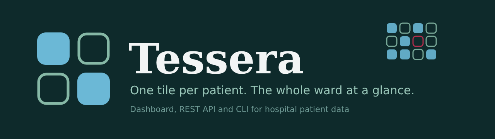
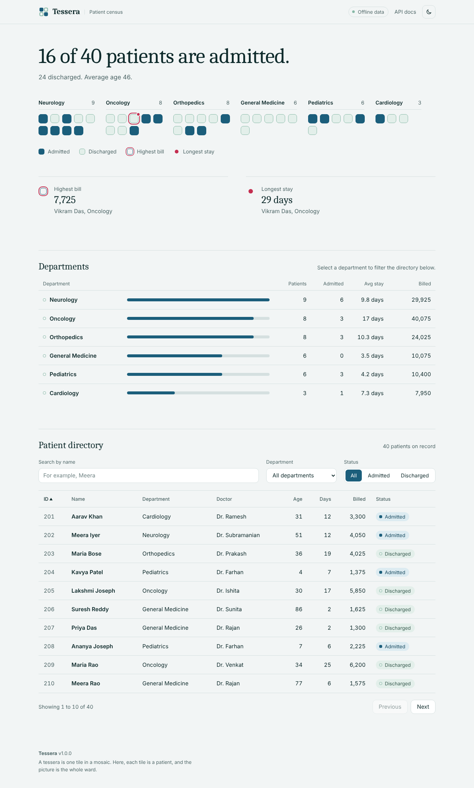
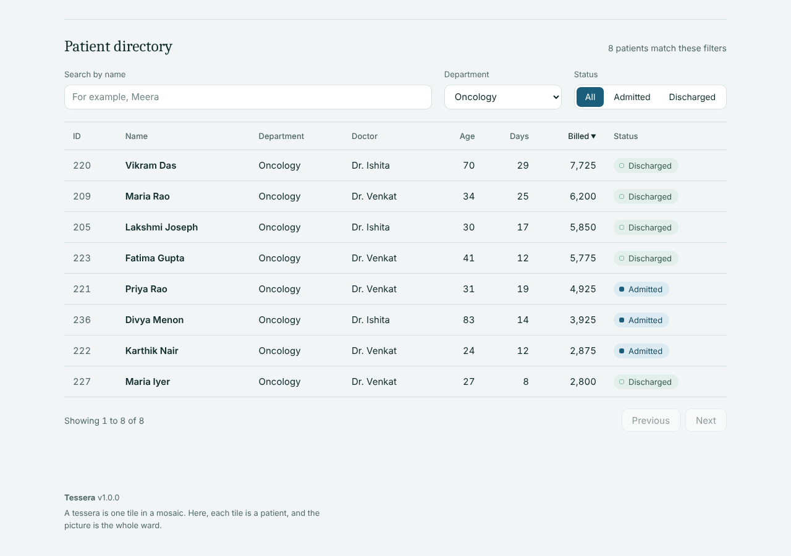
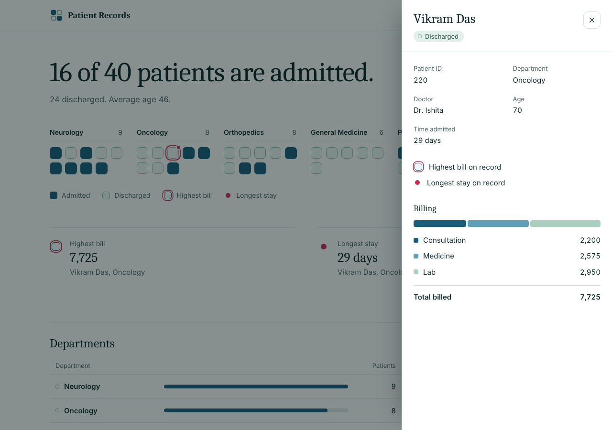
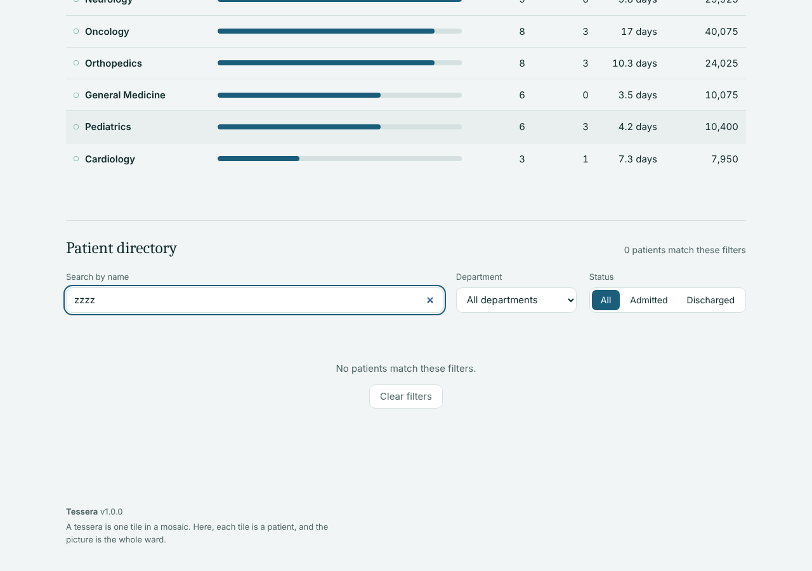
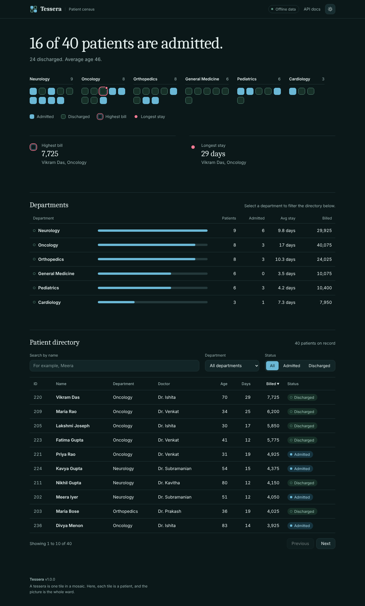
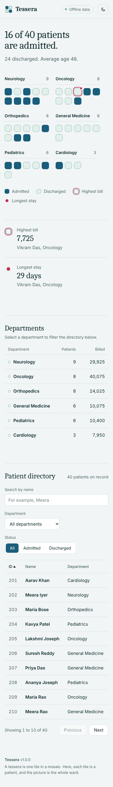
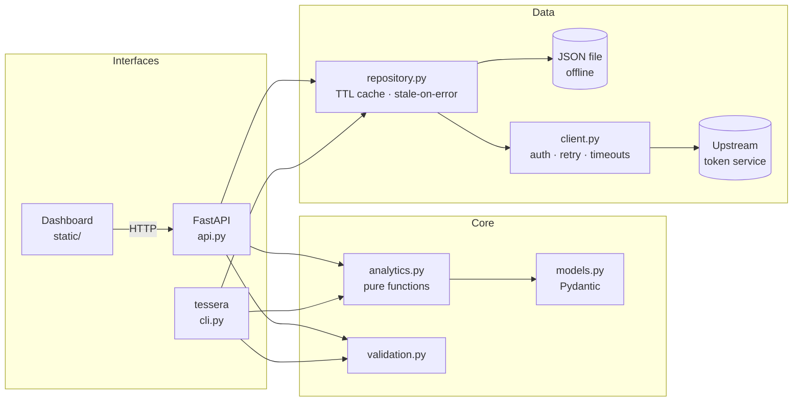
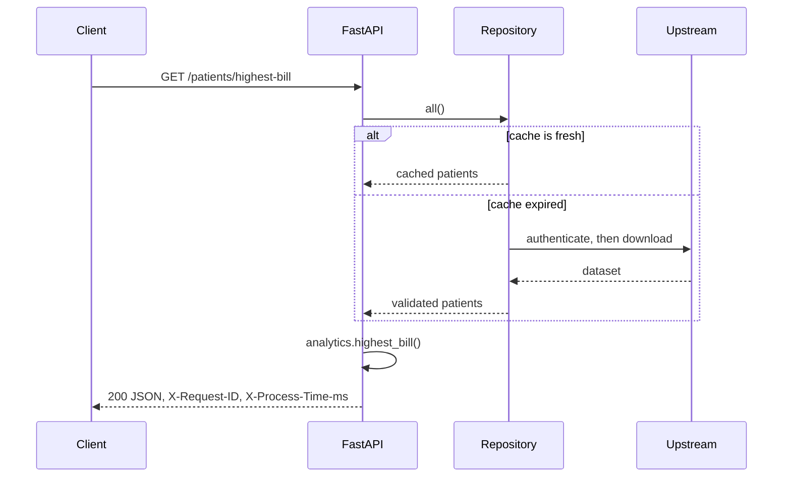

<p align="center">
  
</p>

<p align="center">
  <a href="https://github.com/Sandeepsrinivasan-14/tessera/actions/workflows/ci.yml"></a>
  <a href="https://github.com/Sandeepsrinivasan-14/tessera/actions/workflows/secret-scan.yml"></a>
  
  
  
  
</p>

<p align="center">
  <a href="#quickstart"><b>Quickstart</b></a> &nbsp;|&nbsp;
  <a href="#product-tour"><b>Product tour</b></a> &nbsp;|&nbsp;
  <a href="#api-reference"><b>API</b></a> &nbsp;|&nbsp;
  <a href="#architecture"><b>Architecture</b></a> &nbsp;|&nbsp;
  <a href="docs/operations.md"><b>Operations</b></a>
  &nbsp;|&nbsp;
  <a href="https://codespaces.new/Sandeepsrinivasan-14/tessera?quickstart=1"><b>Open in Codespaces</b></a>
</p>

# Tessera

**A patient census you can read at a glance.** Tessera turns hospital patient records into a
dashboard, a documented REST API and a command-line tool, all built on one tested analytics core.

> **Why "Tessera"?** A *tessera* is a single tile in a mosaic. Here every patient is one tile, and
> the picture they make together is the ward: who is admitted, who has gone home, which department
> is busiest, and which record stands out. The four-tile logo follows the same language: filled for
> admitted, hollow for discharged.

## Contents

- [Overview](#overview)
- [Quickstart](#quickstart)
- [Product tour](#product-tour)
- [API reference](#api-reference)
- [Command line](#command-line)
- [Architecture](#architecture)
- [Configuration](#configuration)
- [Security and credentials](#security-and-credentials)
- [Design decisions](#design-decisions)
- [Quality and testing](#quality-and-testing)
- [Project layout](#project-layout)
- [Roadmap](#roadmap)
- [Author and license](#author-and-license)

## Overview

Tessera began as coursework scripts for a Patient API assignment and has been rebuilt as an
installable, typed and tested service. Every rule from the original brief is still present, now as a
reusable function shared by the dashboard, the API and the CLI.

| Capability | Detail |
| --- | --- |
| Dashboard | Patient census, department ledger, searchable and sortable directory, patient drawer, light and dark themes |
| REST API | Ten routes with Swagger UI at `/docs`, uniform `{"message": ...}` errors, request IDs and timing headers |
| Analytics | Highest bill, longest stay, admission summary and per-department rollups, as pure functions |
| Resilient client | Token authentication, timeouts, and retry with backoff for sleepy free-tier hosts |
| Caching | TTL cache that serves stale data when a refresh fails, so an outage does not become an error |
| CLI | `tessera` with JSON or table output, a `doctor` configuration check and meaningful exit codes |
| Secure by default | No credentials in source, `.env` loading, Gitleaks in CI and pre-commit, strict CSP on the dashboard |
| Deployable | Multi-stage non-root Docker image with a health check, plus `docker-compose.yml` |

> **Data note:** the repository ships a fully synthetic dataset (`data/sample_patients.json`) so
> everything runs offline. It contains no real patient data and no credentials.

## Quickstart

Choose how you want to run it.

<details open>
<summary><b>Option 1: Offline demo (no credentials, about one minute)</b></summary>

```bash
git clone https://github.com/Sandeepsrinivasan-14/tessera.git
cd tessera
python -m venv .venv && source .venv/bin/activate
pip install -e ".[dev]"

export PATIENT_API_DATA_FILE=data/sample_patients.json
tessera serve
```

Then open <http://127.0.0.1:8000/> for the dashboard or <http://127.0.0.1:8000/docs> for the API.

</details>

<details>
<summary><b>Option 2: One click in GitHub Codespaces</b></summary>

Use the **Open in Codespaces** link at the top of this page. The environment installs Tessera,
starts the offline demo and forwards port 8000, so the dashboard opens in your browser with nothing
to set up locally.

</details>

<details>
<summary><b>Option 3: Docker</b></summary>

```bash
docker compose up --build
```

The offline demo is then available on <http://localhost:8000>.

</details>

<details>
<summary><b>Option 4: Against the real upstream service</b></summary>

```bash
cp .env.example .env     # fill in your credentials
tessera doctor           # confirms the setup; secrets are never printed
tessera serve
```

`.env` is loaded automatically, is git-ignored, and real environment variables take priority over it.

</details>

## Product tour

The dashboard is plain HTML, CSS and JavaScript served by the API itself. There is nothing to build
and it makes no third-party requests.

### The census



The headline answers the first question a ward lead asks: how many patients are admitted right now?
Below it, every patient is one tile, grouped by department. A **filled** tile is an admitted patient,
a **hollow** tile is a discharged patient, a **rose ring** marks the highest bill and a **rose dot**
marks the longest stay. The department ledger compares volume, admissions, average stay and billing,
and the directory lists every record.

### Filter by department



Select a department in the ledger and the directory narrows to it. Search by name, filter by status,
and sort any column. Sorting runs on the server before paging, so it ranks the whole dataset.

### Open a patient



Click a tile or a row to open the record in a drawer with the billing breakdown, time admitted,
doctor and status. Focus moves into the drawer, `Esc` closes it, and focus returns to where you were.

### Empty results



An empty result says so and offers a way back, rather than showing a blank table.

### Dark theme and phones

| Dark theme | Phone width |
| --- | --- |
|  |  |

The theme follows the system setting, can be switched from the header, and is remembered. The layout
works down to phone width with no horizontal scrolling.

<details>
<summary><b>Accessibility and security of the dashboard</b></summary>

- Full keyboard support, visible focus, labelled controls, and `prefers-reduced-motion` respected.
- Served under a strict Content-Security-Policy (`script-src 'self'; style-src 'self'`).
- API text is inserted with `textContent` only, never `innerHTML`.
- Tests fail if inline scripts or styles, third-party URLs, `innerHTML`, `eval` or `document.write` appear.

</details>

## API reference

Interactive documentation is served at `/docs` (Swagger UI) and `/redoc`.

| Method | Path | Description | Errors |
| --- | --- | --- | --- |
| GET | `/` | The dashboard | |
| GET | `/health` | Liveness probe | |
| GET | `/meta` | Version and data source (never any credentials) | |
| GET | `/patients` | List with `department`, `status`, `q`, `sort`, `order`, `limit`, `offset` | 422 bad paging or sort field |
| GET | `/patients/{id}` | One patient | 400 invalid id, 404 not found |
| GET | `/patients/filter?department=` | Patients in a department (case-insensitive) | 400 missing parameter |
| GET | `/patients/highest-bill` | Highest total bill (consultation, medicine and lab) | 404 no data |
| GET | `/patients/longest-stay` | Longest admission | 404 no data |
| GET | `/patients/admission/summary` | Admitted and discharged counts, mean age | 404 no data |
| GET | `/analytics/departments` | Per-department rollup | |

`sort` accepts `id`, `name`, `department`, `age`, `daysAdmitted` or `totalBill`, and `order` is `asc`
or `desc`. Upstream failures return **502** and missing credentials return **503**. `/health` keeps
working in both cases.

<details>
<summary><b>Try it: example requests and responses</b></summary>

```bash
curl -s localhost:8000/patients/admission/summary
curl -s localhost:8000/patients/highest-bill
curl -s "localhost:8000/patients?department=Oncology&sort=totalBill&order=desc&limit=3"
curl -s localhost:8000/patients/abc
curl -s localhost:8000/patients/9999
```

```json
{ "admittedCount": 16, "dischargedCount": 24, "averageAge": 45.98 }
{ "id": 220, "name": "Vikram Das", "department": "Oncology", "totalBill": 7725.0 }
{ "message": "Invalid ID format. ID must be a number." }
{ "message": "patient 9999 not found" }
```

</details>

## Command line

```bash
tessera doctor                            # check configuration (never prints secrets)
tessera summary                           # admission summary
tessera get 201                           # one patient
tessera filter cardiology --format table  # patients in a department
tessera departments --format table        # per-department rollup
tessera highest-bill
tessera longest-stay
tessera serve --port 8000 --reload        # dashboard and API
```

Exit codes: `0` success, `1` not found or bad input, `2` configuration error. Global options
(`--data-file`, `--format json|table`, `-v`) work before or after the subcommand.

## Architecture



The dashboard, API and CLI all depend on one pure analytics core. The data source sits behind a small
`PatientRepository` protocol, so replacing the file or remote source with a database touches one
module. The dependency direction is strictly downward; see [docs/architecture.md](docs/architecture.md).

<details>
<summary><b>Request flow for <code>GET /patients/highest-bill</code></b></summary>



</details>

## Configuration

Set these in `.env` (copy `.env.example`) or as environment variables.

| Variable | Default | Purpose |
| --- | --- | --- |
| `PATIENT_API_STUDENT_ID` | none | Upstream account id (remote mode) |
| `PATIENT_API_PASSWORD` | none | Upstream password (remote mode) |
| `PATIENT_API_SET` | `setA` | Dataset set to request |
| `PATIENT_API_BASE_URL` | `https://t4e-testserver.onrender.com/api` | Upstream base URL |
| `PATIENT_API_TIMEOUT` | `45` | Seconds per upstream request |
| `PATIENT_API_RETRIES` | `3` | Retries on 429, 502, 503 and 504 |
| `PATIENT_API_CACHE_TTL` | `60` | Seconds a fetched dataset is reused |
| `PATIENT_API_DATA_FILE` | none | If set, read this file and skip the network |

## Security and credentials

- Secrets are read only from the environment or a local, git-ignored `.env`. None are in the repository.
- `tessera doctor` reports each secret as set or missing and never prints a value. Tests enforce this.
- `/meta` and every other endpoint expose no credential data. Tests enforce this too.
- **Gitleaks** runs in CI and as a pre-commit hook, so a secret is caught before it reaches GitHub.
- The bundled API has no authentication of its own and the data is synthetic. Do not point it at real
  patient records without adding access control, audit logging and encryption.

See [SECURITY.md](SECURITY.md) for the full policy and what to do if a secret is ever committed.

## Design decisions

<details>
<summary><b>Show the reasoning behind the main choices</b></summary>

- **Deterministic tie-breaking.** Highest bill: the first record wins. Longest stay: the later record
  wins (`reduce` semantics). Both are pinned by tests.
- **Strict ID parsing.** Python's `int()` accepts `"2_01"` and non-ASCII digits. Patient IDs use a
  stricter rule so malformed input returns a clean 400.
- **One bad record never sinks the dataset.** Malformed rows are logged and skipped.
- **Stale-on-error caching.** A failed refresh serves the last good data instead of an error.
- **Honest sorting.** Sorting happens on the server before pagination.
- **`reduce` is intentional.** The original brief required `functools.reduce` for the admission
  summary and longest stay, and those two functions keep it.
- **camelCase JSON contract preserved** (`daysAdmitted`, `totalBill`) while Python code stays snake_case, via Pydantic aliases.
- **Backward compatible.** The original singular routes remain as hidden aliases.
- **No build step for the UI.** Plain files keep the front end dependency-free and make a strict CSP straightforward.

</details>

## Quality and testing

```bash
make install     # editable install with dev tools
make check       # ruff, mypy --strict and pytest: exactly what CI runs
make serve       # hot-reloading API and dashboard on the sample data
make help        # all targets
```

| Gate | Tool | Status |
| --- | --- | --- |
| Lint and format | ruff | enforced in CI |
| Types | mypy `--strict` | enforced in CI |
| Tests | pytest, 166 tests, 99% coverage | Python 3.10 to 3.13 matrix |
| Container | Docker build and live health check | smoke test in CI |
| Secrets | Gitleaks | CI and pre-commit |

Contributions are welcome: see [CONTRIBUTING.md](CONTRIBUTING.md) and
[docs/operations.md](docs/operations.md).

## Project layout

<details>
<summary><b>Show the file tree</b></summary>

```
.
|-- src/tessera/
|   |-- api.py            FastAPI app factory, routes, error mapping, dashboard hosting
|   |-- analytics.py      Pure business logic, including sorting
|   |-- cli.py            The tessera command
|   |-- client.py         Authentication and dataset download (retries, timeouts)
|   |-- repository.py     File, remote and in-memory sources, TTL cache
|   |-- models.py         Pydantic models
|   |-- config.py         Environment and .env settings
|   |-- validation.py     Input parsing
|   |-- exceptions.py     Error hierarchy
|   `-- static/           Dashboard: index.html, styles.css, app.js, theme.js
|-- tests/                Unit, API, client, CLI, dashboard and credential tests
|-- data/                 Synthetic sample dataset
|-- scripts/              Reproducible dataset generator
|-- docs/                 Architecture, operations, screenshots
|-- .devcontainer/        One-click Codespaces setup
|-- .github/workflows/    CI and secret scan
|-- Dockerfile, docker-compose.yml, Makefile
`-- pyproject.toml
```

</details>

## Roadmap

- [ ] Pluggable database repository (SQLite or PostgreSQL) behind the existing protocol
- [ ] API-key authentication and rate limiting for the HTTP layer
- [ ] Date-based analytics and trend charts once admission and discharge timestamps exist
- [ ] Prometheus metrics endpoint

## Author and license

Built by **Sandeep Srinivasan S**, B.Tech Computer Science and Medical Engineering (AI and Data
Analytics), SRIHER, Chennai. Licensed under the [MIT License](LICENSE).
